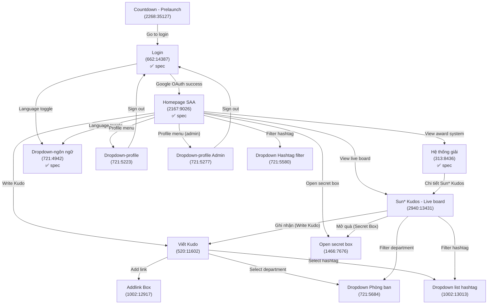
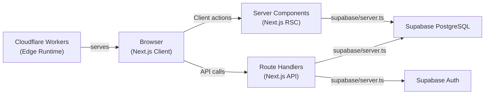

# Screen Flow: SAA 2025 — Sun Annual Awards

**Project**: Agentic Coding Hands-on (SAA 2025)
**Figma File Key**: `9ypp4enmFmdK3YAFJLIu6C`
**Figma URL**: https://www.figma.com/design/9ypp4enmFmdK3YAFJLIu6C/SAA-2025---Internal-Live-Coding
**Last Updated**: 2026-03-13

---

## Discovery Progress

| Metric | Value |
|--------|-------|
| Total Frames | 17 |
| Fully Specified | 6 (Login, Homepage SAA, Hệ thống giải, Countdown - Prelaunch, Dropdown-ngôn ngữ, Sun* Kudos - Live board) |
| In Progress | 0 |
| Remaining | 11 |
| Completion | 35% |

---

## Screens

| Screen Name | Frame ID | Figma Link | Status | Spec File | Predicted APIs | Navigations |
|-------------|----------|------------|--------|-----------|----------------|-------------|
| Login | `662:14387` | [Link](https://momorph.ai/files/9ypp4enmFmdK3YAFJLIu6C/frames/662:14387) | ✅ spec | `specs/662-14387-Login/` | `supabase.auth.signInWithOAuth` | → Homepage, → Dropdown-ngôn ngữ |
| Homepage SAA | `2167:9026` | [Link](https://momorph.ai/files/9ypp4enmFmdK3YAFJLIu6C/frames/2167:9026) | ✅ spec | `specs/2167-9026-Homepage-SAA/` | `GET /awards`, `GET /notifications` | ← Login, → Awards Info, → Sun* Kudos, → Viết Kudo, → Live board |
| Countdown - Prelaunch page | `2268:35127` | [Link](https://momorph.ai/files/9ypp4enmFmdK3YAFJLIu6C/frames/2268:35127) | ✅ spec | `specs/2268-35127-Countdown-Prelaunch-page/` | `GET /countdown` | → Login |
| Viết Kudo | `520:11602` | [Link](https://momorph.ai/files/9ypp4enmFmdK3YAFJLIu6C/frames/520:11602) | pending | - | `POST /kudos` | ← Homepage, → Addlink Box |
| Sun* Kudos - Live board | `2940:13431` | [Link](https://momorph.ai/files/9ypp4enmFmdK3YAFJLIu6C/frames/2940:13431) | ✅ spec | `specs/2940-13431-sun-kudos-live-board/` | `GET /kudos/live`, `GET /kudos/highlight`, `GET /kudos/spotlight`, `GET /kudos/stats`, `GET /secretbox/stats`, `GET /sunners/recent-gifts` | ← Homepage, ← Hệ thống giải, → Dropdown list hashtag, → Dropdown Phòng ban, → Open secret box, → Viết Kudo |
| Hệ thống giải | `313:8436` | [Link](https://momorph.ai/files/9ypp4enmFmdK3YAFJLIu6C/frames/313:8436) | ✅ spec | `specs/313-8436-He-thong-giai/` | `GET /awards` | ← Homepage, → Sun* Kudos |
| Open secret box- chưa mở | `1466:7676` | [Link](https://momorph.ai/files/9ypp4enmFmdK3YAFJLIu6C/frames/1466:7676) | pending | - | `POST /secretbox/open` | ← Homepage |
| Addlink Box | `1002:12917` | [Link](https://momorph.ai/files/9ypp4enmFmdK3YAFJLIu6C/frames/1002:12917) | pending | - | `POST /links` | ← Viết Kudo |
| Dropdown-ngôn ngữ | `721:4942` | [Link](https://momorph.ai/files/9ypp4enmFmdK3YAFJLIu6C/frames/721:4942) | ✅ spec | `specs/721-4942-Dropdown-ngon-ngu/` | none (client-side) | ← Login header, ← Homepage header |
| Dropdown-profile | `721:5223` | [Link](https://momorph.ai/files/9ypp4enmFmdK3YAFJLIu6C/frames/721:5223) | pending | - | `supabase.auth.signOut` | ← Homepage |
| Dropdown-profile Admin | `721:5277` | [Link](https://momorph.ai/files/9ypp4enmFmdK3YAFJLIu6C/frames/721:5277) | pending | - | `supabase.auth.signOut` | ← Homepage (admin) |
| Dropdown Phòng ban | `721:5684` | [Link](https://momorph.ai/files/9ypp4enmFmdK3YAFJLIu6C/frames/721:5684) | pending | - | `GET /departments` | ← Viết Kudo |
| Dropdown Hashtag filter | `721:5580` | [Link](https://momorph.ai/files/9ypp4enmFmdK3YAFJLIu6C/frames/721:5580) | pending | - | `GET /hashtags` | ← Homepage |
| Dropdown list hashtag | `1002:13013` | [Link](https://momorph.ai/files/9ypp4enmFmdK3YAFJLIu6C/frames/1002:13013) | pending | - | `GET /hashtags` | ← Viết Kudo, ← Live board |
| Floating Action Button | `313:9137` | [Link](https://momorph.ai/files/9ypp4enmFmdK3YAFJLIu6C/frames/313:9137) | pending | - | - | - |
| Floating Action Button 2 | `313:9139` | [Link](https://momorph.ai/files/9ypp4enmFmdK3YAFJLIu6C/frames/313:9139) | pending | - | - | - |
| Thể lệ UPDATE | `3204:6051` | [Link](https://momorph.ai/files/9ypp4enmFmdK3YAFJLIu6C/frames/3204:6051) | pending | - | - | - |

---

## Navigation Graph



---

## Screen Groups

### Authentication

| Screen | Route | Access |
|--------|-------|--------|
| Login | `/login` | Public |
| Countdown - Prelaunch | `/countdown` | Public (pre-launch only) |

### Main Application (requires auth)

| Screen | Route | Access |
|--------|-------|--------|
| Homepage SAA | `/` | Authenticated |
| Viết Kudo | `/kudo/new` | Authenticated |
| Sun* Kudos - Live board | `/kudo/live` | Authenticated |
| Hệ thống giải | `/awards` | Authenticated |
| Open secret box | `/secretbox` | Authenticated |

### Overlay / Dropdown Components

| Component | Trigger | Context |
|-----------|---------|---------|
| Dropdown-ngôn ngữ | Language selector click | Login, Homepage header |
| Dropdown-profile | Profile avatar click | Homepage header |
| Dropdown-profile Admin | Profile avatar click (admin) | Homepage header |
| Dropdown Phòng ban | Department field | Viết Kudo form |
| Dropdown Hashtag filter | Hashtag filter | Homepage feed |
| Dropdown list hashtag | Hashtag field | Viết Kudo form |
| Addlink Box | Add link button | Viết Kudo form |

---

## Screen Detail: Sun* Kudos - Live Board (`2940:13431`)

**Route**: `/kudo/live`
**Figma**: [Link](https://momorph.ai/files/9ypp4enmFmdK3YAFJLIu6C/frames/2940:13431)
**Image**: [Frame Preview](https://momorph.ai/api/images/9ypp4enmFmdK3YAFJLIu6C/2940:13431/383e25934501efd469fb82fdcc6be2f2.png)

### Section Layout

```
+---------------------------------------------------------------+
| Header (LOGO | Nav Links | Language | Profile)                |
+---------------------------------------------------------------+
| [A] Hero Banner - KV Kudos                                    |
|   Title: "Hệ thống ghi nhận lời cảm ơn" + SAA 2025 KUDOS    |
|   [A.1] Write-Kudo Input (pill text field)                    |
+---------------------------------------------------------------+
| [B] HIGHLIGHT KUDOS                                           |
|   [B.1] Header: subtitle + Hashtag filter + Department filter |
|   [B.2] Carousel: 5 top-hearted Kudo cards (prev/next)       |
|     [B.3] Kudo Card: sender avatar+info -> receiver           |
|     [B.4] Content: timestamp, message (3-line), hashtags,     |
|           action bar (hearts, share, detail)                  |
|   [B.5] Pagination: prev | "2/5" | next                      |
+---------------------------------------------------------------+
| [B.6] Spotlight Header: "Sun* Annual Awards 2025"             |
| [B.7] Spotlight Board (word cloud / interactive diagram)      |
|   [B.7.1] "388 KUDOS" total label                            |
|   [B.7.2] Pan/Zoom control                                   |
|   [B.7.3] Search Sunner input                                |
+---------------------------------------------------------------+
| [C] ALL KUDOS                           | [D] Stats Sidebar  |
|   [C.1] Header: subtitle + "ALL KUDOS"  | [D.1] Overview     |
|   [C.2] Kudos feed list                  |  - Kudos received  |
|     [C.3] Kudo Post card:                |  - Kudos sent      |
|       - Sender info + icon + Receiver    |  - Hearts received |
|       - Timestamp                        |  - Secret Box open |
|       - Content (5-line max)             |  - Secret Box left |
|       - Attached images                  |  [D.1.8] Mở quà   |
|       - Hashtags                         |                    |
|     [C.4] Action bar:                    | [D.3] 10 SUNNER    |
|       - Hearts button (toggle)           |   NHẬN QUÀ MỚI    |
|       - Copy Link button                 |   NHẤT (list)      |
|     [C.5-C.7] More Kudo Posts...         |                    |
|                                          | [D.4] Hashtag tags |
+------------------------------------------+--------------------+
```

### Navigation Flows (from this screen)

| Trigger | Action | Target Screen | Frame ID |
|---------|--------|---------------|----------|
| [A.1] Write-Kudo input click | Opens kudo compose form | Viết Kudo | `520:11602` |
| [B.1.1] Hashtag filter button | Opens hashtag dropdown | Dropdown list hashtag | `1002:13013` |
| [B.1.2] Department filter button | Opens department dropdown | Dropdown Phòng ban | `721:5684` |
| [D.1.8] "Mở quà" button | Opens secret box dialog | Open secret box | `1466:7676` |
| Header - Language selector | Opens language dropdown | Dropdown-ngôn ngữ | `721:4942` |
| Header - Profile avatar | Opens profile dropdown | Dropdown-profile | `721:5223` |
| Header - Nav links | Navigates to section | Homepage SAA / Hệ thống giải | `2167:9026` / `313:8436` |

### Navigation Flows (to this screen)

| Source Screen | Trigger | Frame ID |
|---------------|---------|----------|
| Homepage SAA | "View live board" link | `2167:9026` |
| Hệ thống giải | "Chi tiết Sun* Kudos" CTA | `313:8436` |

### Data Requirements

| Section | API Endpoint | Data |
|---------|-------------|------|
| [A] Hero Banner | Static | KV background image, title text |
| [B.2] Highlight Carousel | `GET /api/kudos/highlight` | Top 5 kudos by heart count, supports hashtag + department filter params |
| [B.7] Spotlight Board | `GET /api/kudos/spotlight` | Aggregated kudos data for word cloud visualization (receiver names, counts) |
| [C.2] All Kudos Feed | `GET /api/kudos` | Paginated kudos list with sender/receiver info, content, hashtags, images, heart counts |
| [D.1] Stats Overview | `GET /api/kudos/stats` | User's kudos received/sent counts, hearts received |
| [D.1] Secret Box Stats | `GET /api/secretbox/stats` | User's secret boxes opened/unopened counts |
| [D.3] Recent Gift Recipients | `GET /api/sunners/recent-gifts` | 10 most recent sunners who received gifts (avatar, name, department) |

### Interactive Behaviors

| Component | Interaction | Behavior |
|-----------|-------------|----------|
| Highlight Carousel | Prev/Next buttons | Slides between 5 kudo cards; wraps at boundaries |
| Highlight Carousel | Pagination "2/5" | Updates on slide change |
| Spotlight Board | Pan/Zoom toggle | Switches between pan and zoom modes on the word cloud |
| Spotlight Board | Search input | Filters/highlights sunner names in the word cloud |
| Kudo Card Hearts | Click (toggle) | Like/unlike a kudo; grey heart = not liked, red = liked |
| Kudo Card Copy Link | Click | Copies kudo URL to clipboard, shows toast confirmation |
| Kudo Card Content | Overflow (>3 lines highlight, >5 lines feed) | Truncated with "..." |
| Sender/Receiver Avatar | Hover | Shows profile preview popup |
| Sender/Receiver Avatar | Click | Navigates to sunner profile |

---

## API Endpoints Summary

| Endpoint | Method | Used By |
|----------|--------|---------|
| `supabase.auth.signInWithOAuth` | - | Login |
| `supabase.auth.signOut` | - | Dropdown-profile, Dropdown-profile Admin |
| `/auth/callback` | GET | Login (OAuth callback) |
| `/api/kudos` | GET, POST | Homepage, Viết Kudo, Live board (All Kudos feed) |
| `/api/kudos/highlight` | GET | Live board (Highlight Kudos carousel) |
| `/api/kudos/spotlight` | GET | Live board (Spotlight Board word cloud) |
| `/api/kudos/stats` | GET | Live board (Stats sidebar - kudos sent/received/hearts) |
| `/api/secretbox/stats` | GET | Live board (Stats sidebar - secret box opened/unopened) |
| `/api/sunners/recent-gifts` | GET | Live board (10 Sunner recent gift recipients) |
| `/api/awards` | GET | Hệ thống giải |
| `/api/departments` | GET | Dropdown Phòng ban |
| `/api/hashtags` | GET | Dropdown Hashtag filter, Dropdown list hashtag |
| `/api/links` | POST | Addlink Box |
| `/api/secretbox/open` | POST | Open secret box |
| `/api/countdown` | GET | Countdown - Prelaunch page |

---

## Data Flow



---

## Technical Notes

### Auth
- Authentication provider: **Google OAuth** only (via Supabase)
- Session management: Supabase SSR via `@supabase/ssr`, managed in `src/libs/supabase/middleware.ts`
- Protected routes: All routes except `/login` and `/countdown` require a valid session
- Middleware checks session on every request and redirects unauthenticated users to `/login`

### State Management
- Auth state: Supabase session (server-side, via cookies)
- Language preference: Cookie or localStorage (`lang` key)
- UI state (dropdowns, modals): Local React component state

### Routing
- Framework: Next.js 15 App Router
- Auth callback: `app/auth/callback/route.ts` (Route Handler)
- Protected layout: `app/(protected)/layout.tsx` — checks session, redirects if not authed

---

## Discovery Log

| Date | Action | Details |
|------|--------|---------|
| 2026-03-06 | Initial discovery | Extracted all 14 frames from Figma file `9ypp4enmFmdK3YAFJLIu6C` |
| 2026-03-06 | Spec created | Login screen `662:14387` — full spec + design-style |
| 2026-03-10 | Spec created | Homepage SAA `2167:9026` — full spec + design-style (8 user stories, 6 award cards, countdown, CTA, footer) |
| 2026-03-11 | Spec created | Hệ thống giải `313:8436` — hero banner (Keyvisual), section title, left nav menu (6 award categories), award info cards (Top Talent, Top Project, Top Project Leader, Best Manager, Signature 2025 - Creator, MVP), Sun* Kudos section with "Chi tiết" CTA |
| 2026-03-12 | Spec created | Countdown - Prelaunch page `2268:35127` — full-screen countdown timer with glassmorphism digit cards (Days/Hours/Minutes), dark artistic background with gradient overlay, auto-redirect on zero |
| 2026-03-13 | Spec created | Dropdown-ngôn ngữ `721:4942` — language selector dropdown (VN/EN) with flag icons, selected state highlight, client-side i18n, shared header overlay component |
| 2026-03-13 | Spec created | Sun* Kudos - Live board `2940:13431` — full-page Kudos live board with 5 sections: (A) Hero Banner with KV Kudos + write-kudo input, (B) Highlight Kudos carousel (top 5 by hearts) with hashtag/department filters + Spotlight word cloud board with search + pan/zoom, (C) All Kudos feed with sender/receiver cards, hearts, copy-link, attached images, (D) Stats sidebar with kudos sent/received/hearts/secret-box counts, "Mở quà" CTA, and 10 recent gift recipients list |
| 2026-03-13 | Frames updated | Total frames updated from 14 to 17 (added Floating Action Button, Floating Action Button 2, Thể lệ UPDATE) |

---

## Next Steps

- [x] Run `/momorph.specify` for Homepage SAA (`2167:9026`)
- [x] Run `/momorph.specify` for Hệ thống giải (`313:8436`)
- [x] Run `/momorph.specify` for Dropdown-ngôn ngữ (`721:4942`)
- [ ] Run `/momorph.specify` for Viết Kudo (`520:11602`)
- [ ] Create API spec (`.momorph/API.yml`)
- [ ] Design database schema (`.momorph/database.sql`)
- [ ] Run `/momorph.plan` for Login after spec review
