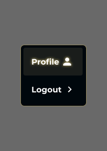

# Feature Specification: Dropdown-profile (Profile Dropdown)

**Frame ID**: `721:5223`
**Frame Name**: `Dropdown-profile`
**File Key**: `9ypp4enmFmdK3YAFJLIu6C`
**Created**: 2026-03-31
**Status**: Reviewed

---

## Overview

A profile dropdown menu component that appears when the user clicks their avatar in the header. It provides two actions: navigating to the user's profile page and logging out. The dropdown uses the same visual language as the language dropdown (dark background, gold border) and is displayed as an overlay anchored to the avatar trigger in the header.

**Design Reference**: 

**Figma**: [View Frame](https://momorph.ai/files/9ypp4enmFmdK3YAFJLIu6C/frames/721:5223)

### Existing Implementation

No dedicated profile dropdown component currently exists. The header has an avatar button in `src/components/homepage/header.tsx` (lines 121–134) that renders a 10x10 rounded square with `user-avatar` icon and gold border (`#998C5F`), but it **currently has no click handler or dropdown logic** — it is a placeholder. This spec defines a new `ProfileDropdown` component to be wired to that trigger.

### Related Specs

- **Homepage SAA** (`specs/2167-9026-Homepage-SAA/`): Defines the header where the avatar trigger lives
- **Dropdown-ngon-ngu** (`specs/721-4942-Dropdown-ngon-ngu/`): Sibling dropdown using the same `Dropdown-List` component set (`563:8216`) — shares visual styling
- **Dropdown-profile Admin** (Frame `721:5277`): Admin variant with an additional "Dashboard" menu item — not yet specified
- **Login** (`specs/662-14387-Login/`): Target redirect after logout

---

## User Scenarios & Testing

### User Story 1 - Navigate to Profile Page (Priority: P1)

A logged-in user wants to access their profile page to view or edit their personal information.

**Why this priority**: Primary action of the dropdown. Users need quick access to their profile from any page.

**Independent Test**: Render the dropdown, click on "Profile", verify navigation to the profile page and dropdown closes.

**Acceptance Scenarios**:

1. **Given** the dropdown is open, **When** the user clicks "Profile", **Then** the application navigates to the user's profile page (`/profile` or equivalent) and the dropdown closes.
2. **Given** the dropdown is open and the user is already on the profile page, **When** the user clicks "Profile", **Then** the dropdown closes without triggering a redundant navigation.
3. **Given** the dropdown is open, **When** the user clicks "Profile" using keyboard (Enter/Space on focused item), **Then** the same navigation occurs.

---

### User Story 2 - Logout (Priority: P1)

A logged-in user wants to sign out of their account to end their session securely.

**Why this priority**: Essential security action. Users must be able to log out from any page.

**Independent Test**: Render the dropdown, click on "Logout", verify the session is terminated and the user is redirected to the login page.

**Acceptance Scenarios**:

1. **Given** the dropdown is open, **When** the user clicks "Logout", **Then** the Supabase session is terminated (`supabase.auth.signOut()`), the user is redirected to the login page (`/login`), and the dropdown closes.
2. **Given** the user clicks "Logout" but the signOut API call fails, **When** the error occurs, **Then** an error toast/notification is shown and the user remains logged in.
3. **Given** the user clicks "Logout", **When** the signOut is processing, **Then** the "Logout" button shows a loading state (disabled, cursor not-allowed) to prevent double-clicks.

---

### User Story 3 - Toggle Dropdown Visibility (Priority: P1)

A user wants to open and close the profile dropdown to access account actions.

**Why this priority**: The dropdown must be toggleable for the user to interact with it at all.

**Independent Test**: Click the avatar trigger, verify dropdown appears. Click again or click outside, verify dropdown closes.

**Acceptance Scenarios**:

1. **Given** the dropdown is closed, **When** the user clicks the avatar trigger in the header, **Then** the dropdown opens below the trigger showing "Profile" and "Logout" options.
2. **Given** the dropdown is open, **When** the user clicks the avatar trigger again, **Then** the dropdown closes.
3. **Given** the dropdown is open, **When** the user clicks outside the dropdown area, **Then** the dropdown closes.
4. **Given** the dropdown is open, **When** the user presses the Escape key, **Then** the dropdown closes and focus returns to the avatar trigger.
5. **Given** the dropdown is open, **When** the user scrolls the page, **Then** the dropdown closes.
6. **Given** the language dropdown is open, **When** the user clicks the avatar trigger, **Then** the language dropdown closes and the profile dropdown opens.

---

### User Story 4 - Keyboard Navigation (Priority: P2)

A user who relies on keyboard navigation wants to use the profile dropdown without a mouse.

**Why this priority**: Accessibility requirement per constitution (WCAG 2.1 AA). Important but secondary to core functionality.

**Independent Test**: Tab to the avatar trigger, open with Enter/Space, navigate items with arrow keys, select with Enter.

**Acceptance Scenarios**:

1. **Given** focus is on the avatar trigger, **When** the user presses Enter or Space, **Then** the dropdown opens and focus moves to the first menu item ("Profile").
2. **Given** the dropdown is open, **When** the user presses ArrowDown, **Then** focus moves to the next menu item (wrapping from last to first).
3. **Given** the dropdown is open, **When** the user presses ArrowUp, **Then** focus moves to the previous menu item (wrapping from first to last).
4. **Given** focus is on a menu item, **When** the user presses Enter or Space, **Then** that action is triggered and the dropdown closes.
5. **Given** the dropdown is open, **When** the user presses Escape, **Then** the dropdown closes and focus returns to the avatar trigger.
6. **Given** the dropdown is open, **When** the user presses Tab, **Then** the dropdown closes and focus moves to the next focusable element.

---

### Edge Cases

- What happens if the user's session expires while the dropdown is open? The "Profile" click should detect the expired session and redirect to login instead.
- How does the dropdown behave when rendered in a narrow viewport (360px)? Dropdown position MUST NOT overflow the viewport — adjust position if needed.
- What if the trigger is near the bottom of the viewport? Dropdown SHOULD open upward if insufficient space below.
- What happens if the user rapidly toggles the dropdown? Animation must not glitch — use `pointer-events: none` during transition or debounce.
- What if `signOut()` takes a long time? Show a loading indicator on the Logout button after 300ms to prevent repeated clicks.

---

## UI/UX Requirements *(from Figma)*

### Screen Components

| Component | Description | Interactions |
|-----------|-------------|--------------|
| Avatar Trigger (in header) | User's avatar image in the header | Click toggles dropdown. **Defined in Homepage SAA spec, not this frame.** |
| Dropdown Container | Dark background panel (#00070C) with gold border (#998C5F), 8px radius, 6px padding | Opens below avatar trigger, closes on selection/outside click/Escape |
| Profile Item | Highlighted item with gold background `rgba(255,234,158,0.1)`, text "Profile" + user icon, text glow effect | Click navigates to profile page |
| Logout Item | Transparent background, text "Logout" + chevron-right icon | Click triggers logout and redirect to login |

### Navigation Flow

- **Entry points**: Header avatar button on Homepage SAA (`2167:9026`) and other authenticated pages
- **Profile click**: Navigates to user's profile page (`/profile`)
- **Logout click**: Signs out via Supabase → redirects to Login page (`/login`)
- **Triggers**: Click on avatar trigger in header
- **Item order**: Fixed order — "Profile" always first, "Logout" always second

### Visual Requirements

> See [design-style.md](design-style.md) for complete visual specifications including colors, typography, spacing, and component states.

- **Positioning**: Absolutely positioned below avatar trigger, **right-aligned** (dropdown right edge = trigger right edge), z-index 100 (above header z-40)
- **Responsive**: Dropdown has fixed dimensions, positioned relative to trigger across all breakpoints
- **Animations**: Fade-in/out + scale with 150ms ease-out on open/close
- **Accessibility**: WCAG 2.1 AA — keyboard navigable, visible focus ring, ARIA menu pattern
- **Text glow**: "Profile" label has a gold glow text-shadow (`0 4px 4px rgba(0,0,0,0.25), 0 0 6px #FAE287`)

### ARIA Specification

| Attribute | Element | Value |
|-----------|---------|-------|
| `role` | Avatar trigger | `button` |
| `aria-haspopup` | Avatar trigger | `"menu"` |
| `aria-expanded` | Avatar trigger | `{isOpen}` |
| `aria-label` | Avatar trigger | `"User menu"` |
| `role` | Dropdown container | `"menu"` |
| `aria-labelledby` | Dropdown container | `{triggerId}` |
| `role` | Each item | `"menuitem"` |
| `tabindex` | Focused item | `0` (others `-1`) |

---

## Requirements

### Functional Requirements

- **FR-001**: System MUST display a dropdown with exactly two menu items: "Profile" and "Logout"
- **FR-002**: System MUST visually distinguish the "Profile" item with a gold-tinted background (`rgba(255,234,158,0.1)`) and text glow effect
- **FR-003**: Clicking "Profile" MUST navigate the user to the profile page (`/profile`)
- **FR-004**: Clicking "Logout" MUST terminate the Supabase session via `supabase.auth.signOut()` and redirect to `/login`
- **FR-005**: System MUST close the dropdown after any menu item is clicked
- **FR-006**: System MUST close the dropdown when the user clicks outside, presses Escape, or scrolls the page
- **FR-007**: System MUST close any other open header dropdown (e.g., language dropdown) when this dropdown opens, and vice versa — only one header dropdown may be open at a time
- **FR-008**: System MUST show a loading state on "Logout" while the signOut is processing
- **FR-009**: System MUST handle signOut errors gracefully by showing an error notification

### Technical Requirements

- **TR-001**: Component MUST be a client component (`"use client"`) — requires browser APIs for click-outside detection and Supabase client for logout
- **TR-002**: Component MUST use ARIA menu pattern (see ARIA Specification table above)
- **TR-003**: Component MUST support full keyboard navigation (Enter, Space, ArrowUp, ArrowDown, Escape, Tab)
- **TR-004**: Dropdown open/close MUST animate with 150ms ease-out transition (opacity + transform)
- **TR-005**: Dropdown MUST render at z-index 100 to appear above the fixed header (z-40)
- **TR-006**: Component MUST use existing `<Icon>` component from `@/components/ui/icon` — use `name="user-avatar"` for profile icon and `name="chevron-right"` for logout icon (verified in codebase)
- **TR-007**: Component MUST use Supabase browser client from `@/libs/supabase/client.ts` for signOut
- **TR-008**: Component MUST use Next.js `useRouter` from `next/navigation` (App Router) for navigation after logout
- **TR-009**: Component MUST share the same `Dropdown-List` visual styling as the language dropdown for consistency

### Key Entities

- **User Session**: Managed by Supabase Auth — dropdown visibility is implicitly tied to being authenticated
- **Profile Page**: Target of "Profile" navigation — **route does NOT exist yet** (`/profile` proposed, needs to be created). See Dependencies.
- **Login Page**: Target redirect after successful logout (`/login`) — exists at `src/app/login/page.tsx`

---

## API Dependencies

| Endpoint | Method | Purpose | Status |
|----------|--------|---------|--------|
| `supabase.auth.signOut()` | POST (internal) | Terminate user session | Exists (Supabase SDK) |
| `supabase.auth.getUser()` | GET (internal) | Verify session is active (optional) | Exists (Supabase SDK) |

**Note**: No custom API endpoints are needed. The component uses the Supabase JS SDK directly for auth operations.

---

## State Management

### Local State

| State | Type | Default | Description |
|-------|------|---------|-------------|
| `isOpen` | `boolean` | `false` | Whether the dropdown panel is visible |
| `isLoggingOut` | `boolean` | `false` | Whether a signOut request is in progress |

### Props (from parent)

| Prop | Type | Required | Description |
|------|------|----------|-------------|
| `userAvatarUrl` | `string \| null` | No | User's avatar image URL for the trigger (optional, shows default icon if null) |
| `userName` | `string` | No | User's display name for aria-label context |

### Side Effects

- On "Profile" click: navigate to `/profile` via `router.push()`
- On "Logout" click: call `supabase.auth.signOut()`, then `router.push('/login')` on success
- On "Logout" error: show error notification, keep user logged in

---

## Success Criteria

### Measurable Outcomes

- **SC-001**: Profile navigation completes in < 100ms (client-side route change)
- **SC-002**: Logout completes and redirects to login in < 2s under normal network conditions
- **SC-003**: Dropdown opens/closes smoothly with 150ms animation, no layout shift
- **SC-004**: All interactive elements are keyboard-accessible and have visible focus indicators
- **SC-005**: Component passes `axe-core` accessibility audit with zero violations

---

## Out of Scope

- Admin variant with "Dashboard" item (covered by separate frame `721:5277`)
- User avatar upload or profile editing functionality (handled by profile page)
- Notification badges on the avatar trigger
- Multi-account switching
- Redesigning the avatar trigger button itself (visual changes are defined in Homepage SAA header spec). **Note**: wiring the `onClick` handler to open this dropdown IS in scope — see Dependencies.
- Session timeout/refresh handling (managed by Supabase middleware)

---

## Dependencies

- [x] Constitution document exists (`.momorph/constitution.md`)
- [x] Screen flow documented (`.momorph/SCREENFLOW.md`)
- [x] Supabase client setup exists (`src/libs/supabase/client.ts` — exports `createClient()`)
- [x] `Icon` component exists (`src/components/ui/icon.tsx`)
- [x] `user-avatar` icon exists in `Icon` component (Figma component ID `186:1611` from set `178:1020`)
- [x] `chevron-right` icon exists in `Icon` component (Figma component ID `335:10890` from set `178:1020`)
- [ ] **Profile page route does NOT exist** (`/profile`) — must be created before or alongside this feature
- [x] Login page exists (`/login` → `src/app/login/page.tsx`) for post-logout redirect
- [x] Header avatar trigger exists (`src/components/homepage/header.tsx:121-134`) — needs onClick handler wiring

---

## Notes

- This component is referenced by the Homepage SAA (`2167:9026`) as a header overlay triggered by the user avatar
- The dropdown trigger (avatar) is NOT part of this frame — it lives in the header. This spec covers only the dropdown panel itself
- The "Profile" item has a gold text glow effect and highlighted background as its **default** appearance (always present, not conditional on current route) — this visually distinguishes it as the primary action
- The dropdown uses the same `Dropdown-List` component set (`563:8216`) as the language dropdown — this ensures visual consistency across all header dropdowns
- **Admin variant**: Frame `721:5277` shows an admin version with an extra "Dashboard" item (icon: grid/apps). If the logged-in user has admin privileges, the admin variant should be shown instead. This logic should be handled by a parent component or a prop, not within this dropdown component itself
- Font: Montserrat Bold 16px is used for menu labels — already available in project fonts at `src/fonts/`
- The chevron-right icon on "Logout" suggests it triggers a navigation/redirect action, reinforcing the UX pattern
- **Icon fill behavior differs**: `user-avatar` SVG has `fill="white"` (hardcoded), while `chevron-right` uses `fill="currentColor"` (inherits from parent CSS `color`). The Logout item must set `color: white` for the chevron to render correctly. See design-style.md Icon Specifications for details.
